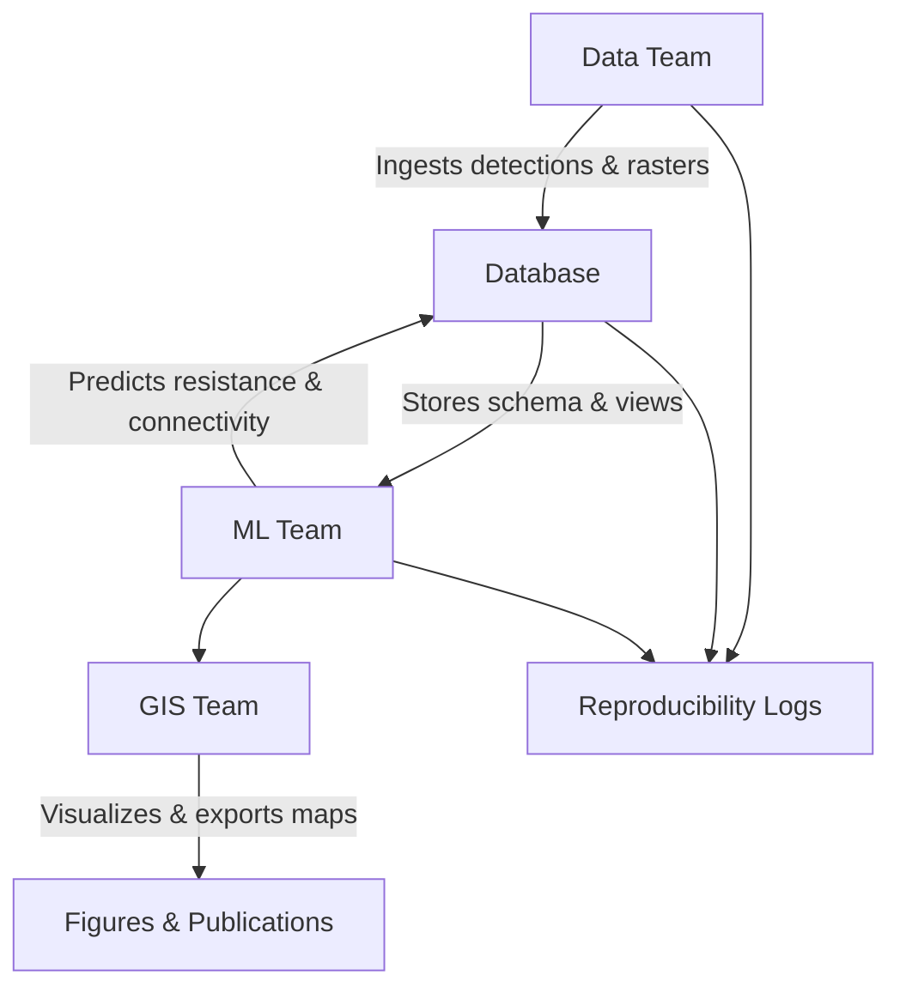

# **Eco Connectivity Workflow**

A modular, reproducible workflow for modeling ecological connectivity, integrating database management, machine learning, GIS visualization, and data ingestion.

## **Overview**

The initiative is structured as a **modular GitHub stack**, allowing multiple teams to work in parallel while keeping the workflow fully reproducible.

### **Modular Components**

| Module | Purpose | Repository |
|--------|---------|------------|
| **Database** | PostgreSQL/PostGIS schema and workflow views | [`db-schema`](https://github.com/cao-connectivity-lab/db-schema) |
| **Machine Learning** | Python scripts for resistance modeling and connectivity analysis | [`ml-models`](https://github.com/cao-connectivity-lab/ml-models) |
| **GIS Projects** | QGIS projects, styles, and figure templates | [`qgis-projects`](https://github.com/cao-connectivity-lab/qgis-projects) |
| **Data Management** | Ingests environmental rasters and camera trap data | [`data-management`](https://github.com/cao-connectivity-lab/data-management) |
| **Reproducibility Logs** | Tracks scenarios, git commits, and outputs for traceability | [`reproducibility-logs`](https://github.com/cao-connectivity-lab/reproducibility-logs) |

---

## **Workflow Diagram**




### **How It Works**

1. **Data Team** – Prepares and ingests environmental rasters and camera trap data into the database.
2. **Database (DB) Team** – Maintains PostGIS schema, tables, and workflow views.
3. **ML Team** – Runs resistance and connectivity models, storing outputs back in the database.
4. **GIS Team** – Connects to the database in QGIS, visualizes results, and exports maps.
5. **Reproducibility Logs** – Tracks all actions, scenario IDs, and git commits for full traceability.

## **Getting Started**

### **Technical Stack**

* PostgreSQL + PostGIS (or Docker setup)
* Python ≥ 3.9
* QGIS ≥ 3.28 (for project visualization)
* Git

### **Steps**

1. **Clone the module repositories:**

```bash
git clone https://github.com/eco-connectivity-lab/db-schema.git
git clone https://github.com/eco-connectivity-lab/ml-models.git
git clone https://github.com/eco-connectivity-lab/qgis-projects.git
git clone https://github.com/eco-connectivity-lab/data-management.git
git clone https://github.com/eco-connectivity-lab/reproducibility-logs.git
```

2. **Set up the database:**

```bash
cd db-schema
./setup_db.sh
```

3. **Run ML scripts on sample/test data:**

```bash
cd ml-models
python scripts/extract_features.py
python scripts/resistance_model.py
python scripts/predict_resistance.py
```

4. **Open QGIS projects for visualization:**

```bash
cd qgis-projects/projects
qgis eco_connectivity.qgz
```

5. **Track processing with reproducibility logs:**

```bash
cd reproducibility-logs
python scripts/update_logs.py
```

## **Upcoming Enhancements**

* **Docker & Docker Compose:** Launch a full environment (PostGIS \+ Python \+ TimescaleDB) with one command.  
* **CI/CD:** GitHub Actions can test SQL views, Python scripts, and QGIS project validity.  
* **Cloud Integration:** Large raster datasets stored as Cloud-Optimized GeoTIFFs (COGs) on S3 or GCS, referenced in the database.

## **License**

GNU GPL v3 license – freely explore and adapt this workflow.
